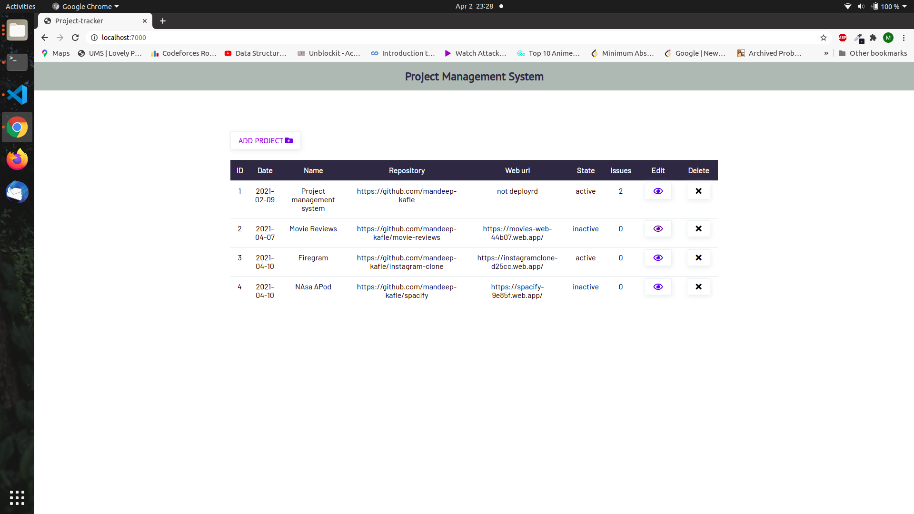
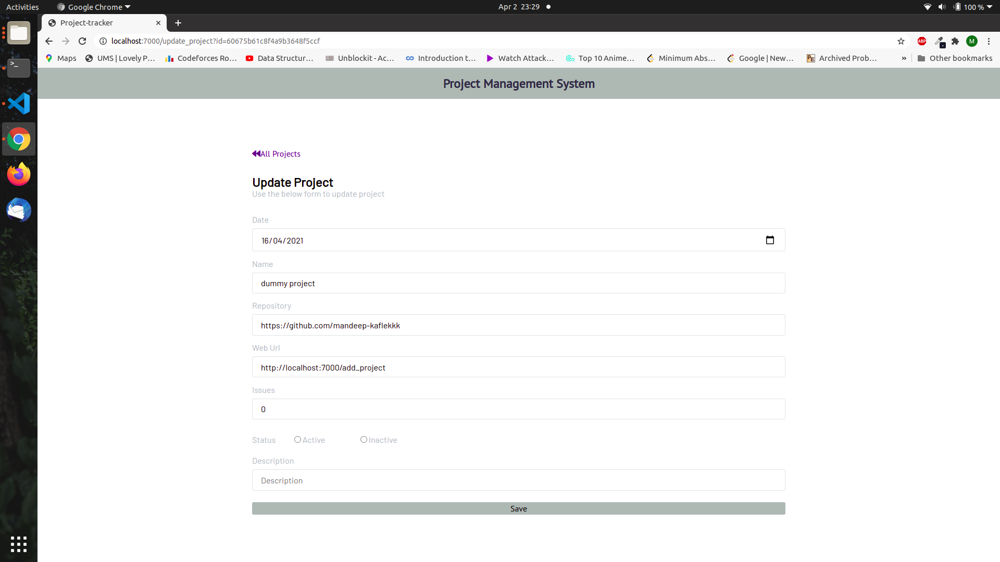
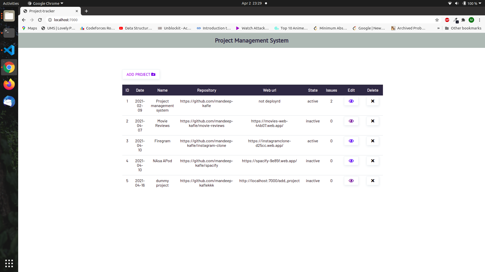

Preview

#intialize npm package

npm init

# Install dependencies

sudo npm i express morgan ejs body-parser dotenv mongoose axios

#Install nodemon as a dev dependency

npm install --save-dev nodemon

#RUN
